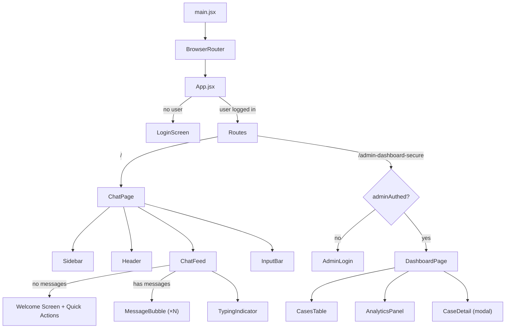
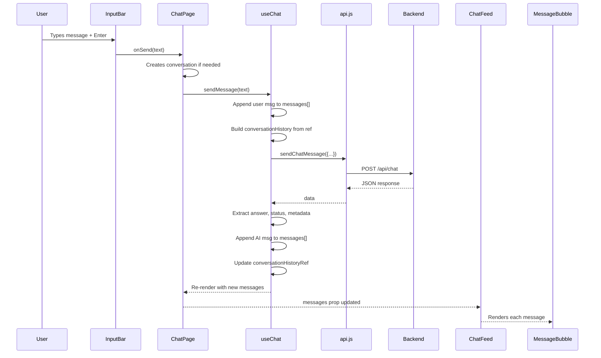

# CreditAssist AI — Frontend Architecture Guide

> A complete reference for understanding, modifying, and extending the frontend.

---

## File Tree

```
src/
├── main.jsx                          # Entry point — mounts <App> inside <BrowserRouter>
├── App.jsx                           # Root component — routing + auth gates
├── index.css                         # Design system — tokens, animations, utilities
│
├── lib/
│   └── api.js                        # API client — all fetch calls to backend
│
├── hooks/
│   ├── useChat.js                    # Core chat state machine + API integration
│   └── useConversations.js           # Conversation thread management (unused currently)
│
├── pages/
│   ├── ChatPage.jsx                  # Main chat orchestrator page
│   └── DashboardPage.jsx             # Staff dashboard page (admin-only)
│
└── components/
    ├── LoginScreen.jsx               # Member login (name + optional member ID)
    ├── AdminLogin.jsx                # Staff passcode gate (innorve2026)
    ├── Header.jsx                    # Top bar — branding + language selector
    ├── Sidebar.jsx                   # Left sidebar — conversations + user profile
    ├── ChatFeed.jsx                  # Message list + welcome screen + quick actions
    ├── MessageBubble.jsx             # Individual message — user or AI with metadata
    ├── InputBar.jsx                  # Text input + mic + paperclip + send button
    ├── TypingIndicator.jsx           # Animated "AI is typing..." dots
    └── dashboard/
        ├── CasesTable.jsx            # Cases list with priority/status badges
        ├── CaseDetail.jsx            # Case detail modal overlay
        └── AnalyticsPanel.jsx        # Stats cards + top intents chart
```

---

## Component Hierarchy



---

## Data Flow — How a Message Travels



---

## Route Map

| Route | Component | Auth Required | Description |
|---|---|---|---|
| `/` (no user) | `LoginScreen` | None | Name + Member ID input |
| `/` (logged in) | `ChatPage` | Member login | Main chat interface |
| `/admin-dashboard-secure` | `AdminLogin` → `DashboardPage` | Passcode: `innorve2026` | Staff case management |
| `/*` (any other) | Redirects to `/` | — | Catch-all redirect |

---

## API Layer — `src/lib/api.js`

All backend communication goes through this single file. The backend runs at:

```js
const API_BASE = 'http://localhost:8000';
```

> [!IMPORTANT]
> To change the backend URL (e.g., for production), edit **only this one line** in [api.js](file:///c:/Users/abhis/OneDrive/Desktop/my%20projects/innorve/src/lib/api.js#L1).

### Endpoints

| Function | Method | Endpoint | Used By |
|---|---|---|---|
| `sendChatMessage()` | POST | `/api/chat` | `useChat` hook |
| `getCases()` | GET | `/api/cases` | `DashboardPage` |
| `getAnalytics()` | GET | `/api/analytics` | `DashboardPage` |
| `seedCases()` | POST | `/api/cases/seed` | `DashboardPage` |

### Chat Request Shape

```json
{
  "message": "What is the penalty for breaking my FD?",
  "member_id": "MBR12345",
  "member_name": "Priya Sharma",
  "conversation_id": "uuid-or-null",
  "conversation_history": [
    { "role": "user", "content": "..." },
    { "role": "assistant", "content": "..." }
  ]
}
```

### Chat Response Shape

```json
{
  "conversation_id": "fc1dc354-b312-474c-95e9-c29866242f74",
  "case_id": "CAS-EB9D15",
  "answer": "Thank you for reaching out...",
  "status": "open | resolved | escalated | greeting",
  "intent": "loan | card | dispute | policy | complaint | greeting | confirmation | denial | general",
  "sentiment": "neutral | frustrated | distressed",
  "sentiment_score": 2,
  "kb_sources": ["FD Premature Withdrawal Policy", "FD Interest Rates"],
  "escalation_summary": null
}
```

> [!NOTE]
> The frontend maps `data.answer` → message content, and `data.status` → resolution badge. See [useChat.js L45-46](file:///c:/Users/abhis/OneDrive/Desktop/my%20projects/innorve/src/hooks/useChat.js#L45-L46).

---

## State Management

### App-Level State ([App.jsx](file:///c:/Users/abhis/OneDrive/Desktop/my%20projects/innorve/src/App.jsx))

| State | Type | Purpose |
|---|---|---|
| `user` | `{name, memberId} \| null` | Member identity after login. `null` = show LoginScreen |
| `adminAuthed` | `boolean` | Whether staff passcode was entered correctly |

### Chat State ([useChat.js](file:///c:/Users/abhis/OneDrive/Desktop/my%20projects/innorve/src/hooks/useChat.js))

| State/Ref | Type | Purpose |
|---|---|---|
| `messages` | `Message[]` | All messages displayed in the chat (useState) |
| `isLoading` | `boolean` | True while waiting for API response |
| `conversationId` | `string \| null` | Backend conversation UUID (for multi-turn) |
| `conversationHistoryRef` | `useRef([])` | **Critical** — uses `useRef` (not useState) to avoid stale closure bugs |

> [!WARNING]
> `conversationHistoryRef` is a **ref**, not state. This is intentional — using useState here would cause stale closure issues in the async `sendMessage` callback. Always use `.current` to read/write it.

### ChatPage State ([ChatPage.jsx](file:///c:/Users/abhis/OneDrive/Desktop/my%20projects/innorve/src/pages/ChatPage.jsx))

| State | Type | Purpose |
|---|---|---|
| `sidebarOpen` | `boolean` | Toggle sidebar visibility |
| `conversations` | `Conversation[]` | List of conversation threads for sidebar |
| `activeConvId` | `string \| null` | Currently active conversation thread |
| `conversationStates` | `Record<id, SavedState>` | Saved message history per conversation (for switching) |

---

## Component Props Reference

### LoginScreen
```
Props: { onLogin: ({name, memberId}) => void }
```
Called when user clicks "Start Chatting". If member ID is empty, auto-generates one.

---

### AdminLogin
```
Props: { onAuthenticated: (bool) => void }
```
Hardcoded passcode: `innorve2026`. Shake animation on wrong passcode.

---

### ChatPage
```
Props: { user: {name, memberId} }
```
The main orchestrator. Initializes `useChat` hook, manages conversation switching.

---

### Sidebar
```
Props: {
  isOpen: boolean,
  onToggle: () => void,
  conversations: Conversation[],
  activeId: string | null,
  onSelect: (id) => void,
  onNewChat: () => void,
  user: {name, memberId}
}
```

---

### Header
```
Props: { sidebarOpen: boolean }
```
Uses `sidebarOpen` to offset branding when sidebar is collapsed. Language selector is UI-only (no backend integration yet).

---

### ChatFeed
```
Props: {
  messages: Message[],
  isLoading: boolean,
  onQuickAction: (text) => void,
  onResolve: (text) => void
}
```
Shows welcome screen when `messages.length === 0`. Passes `onResolve` to `MessageBubble` for resolution buttons.

---

### MessageBubble
```
Props: {
  message: Message,
  index: number,
  isLastAiMessage: boolean,
  onResolve: (text) => void
}
```
Resolution buttons (👍 Yes / 👎 No) only appear when:
- `isLastAiMessage === true`
- `message.metadata.resolutionStatus === 'open'`
- User hasn't clicked yet (`resolved === null`)

Clicking sends auto-text: `"Yes, that resolved my issue. Thanks!"` or `"No, that did not resolve my issue."`

---

### InputBar
```
Props: {
  onSend: (text) => void,
  isLoading: boolean
}
```
- Enter → send, Shift+Enter → newline
- Auto-expanding textarea (max 6 rows)
- Mic button = UI-only visual toggle
- Paperclip = UI-only (no file upload backend)

---

### TypingIndicator
```
Props: none
```
Three pulsing gradient dots with staggered animation.

---

## Message Object Shape

Every message in `messages[]` state has this shape:

```js
// User message
{
  id: "1714000000000",        // timestamp-based unique ID
  role: "user",
  content: "What is the FD penalty?",
  timestamp: "2026-04-24T21:30:00.000Z",
}

// AI message
{
  id: "1714000000001",
  role: "assistant",
  content: "Thank you for reaching out...",
  timestamp: "2026-04-24T21:30:02.000Z",
  metadata: {
    resolutionStatus: "open",       // open | resolved | escalated | greeting
    sentiment: "neutral",            // neutral | frustrated | distressed
    kbSources: ["FD Policy"],        // array of KB doc titles
    caseId: "CAS-EB9D15",           // backend case reference
    intent: "policy",                // classified intent
    sentimentScore: 2,               // 1-5 scale
  }
}

// Error message (when API fails)
{
  id: "1714000000001",
  role: "assistant",
  content: "I'm sorry, I'm having trouble connecting...",
  timestamp: "2026-04-24T21:30:02.000Z",
  isError: true,                     // triggers red styling
}
```

---

## Design System — `index.css`

### Color Tokens

| Token | Value | Usage |
|---|---|---|
| `--color-void` | `#0A0A0A` | Page background |
| `--color-surface` | `#111111` | Sidebar, cards |
| `--color-accent` | `#4F7CFF` | Primary blue |
| `--color-accent-glow` | `#6C5CE7` | Purple accent |
| `--color-danger` | `#FF4757` | Errors, P1 cases |
| `--color-warning` | `#FFAA2C` | Warnings, P2 cases |
| `--color-success` | `#2ED573` | Resolved, P3 cases |
| `--color-text-primary` | `#E8E8E8` | Main text |
| `--color-text-secondary` | `#888888` | Labels |
| `--color-text-tertiary` | `#555555` | Muted text |

### CSS Utility Classes

| Class | Effect |
|---|---|
| `.glass` | Light glassmorphism (blur 20px, 3% white bg) |
| `.glass-strong` | Heavy glassmorphism (blur 30px, 6% white bg) |
| `.aura-avatar` | Pulsing blue/purple glow on AI avatar |
| `.recording-btn` | Red pulse animation on mic button |
| `.shimmer-bg` | Moving shimmer highlight effect |

### Animations

| Keyframe | Duration | Used For |
|---|---|---|
| `aura-pulse` | 3s infinite | AI avatar glow |
| `shimmer` | 3s infinite | Loading shimmer |
| `recording-pulse` | 1.5s infinite | Mic recording state |
| `glow-breathe` | — | Background ambient glow |
| `float-in` | — | Element entrance |

---

## Modification Guide

### Change the Backend URL

Edit **one line** in [api.js](file:///c:/Users/abhis/OneDrive/Desktop/my%20projects/innorve/src/lib/api.js#L1):
```js
const API_BASE = 'https://your-production-url.com';
```

---

### Add a New Quick Action Button

Edit [ChatFeed.jsx](file:///c:/Users/abhis/OneDrive/Desktop/my%20projects/innorve/src/components/ChatFeed.jsx#L7-L11):
```js
const QUICK_ACTIONS = [
  { icon: CreditCard, label: 'Check my balance', color: '#4F7CFF' },
  { icon: HelpCircle, label: 'Loan enquiry', color: '#6C5CE7' },
  { icon: AlertTriangle, label: 'Report an issue', color: '#FFAA2C' },
  // ADD NEW:
  { icon: YourIcon, label: 'Your action text', color: '#HEX' },
];
```
Clicking sends the `label` text as a chat message.

---

### Add a New Language Option

Edit [Header.jsx](file:///c:/Users/abhis/OneDrive/Desktop/my%20projects/innorve/src/components/Header.jsx#L5-L10):
```js
const LANGUAGES = [
  { code: 'en', label: 'English', native: 'English' },
  { code: 'kn', label: 'Kannada', native: 'ಕನ್ನಡ' },
  // ADD NEW:
  { code: 'te', label: 'Telugu', native: 'తెలుగు' },
];
```

> [!NOTE]
> Language selection is currently **UI-only**. To make it functional, you'd need to pass the selected language to the API and have the backend prompt Gemini to respond in that language.

---

### Change the Admin Passcode

Edit [AdminLogin.jsx](file:///c:/Users/abhis/OneDrive/Desktop/my%20projects/innorve/src/components/AdminLogin.jsx#L10):
```js
const ADMIN_PASSCODE = 'your-new-passcode';
```

---

### Add New Metadata to AI Messages

1. **Backend** returns new field in `/api/chat` response
2. **useChat.js** — add to `metadata` object at [L53-60](file:///c:/Users/abhis/OneDrive/Desktop/my%20projects/innorve/src/hooks/useChat.js#L53-L60):
   ```js
   metadata: {
     resolutionStatus: resStatus,
     sentiment: data.sentiment,
     kbSources: data.kb_sources || [],
     caseId: data.case_id,
     intent: data.intent,
     sentimentScore: data.sentiment_score,
     newField: data.new_field,  // ← ADD HERE
   }
   ```
3. **MessageBubble.jsx** — render it in the metadata section at [L169-230](file:///c:/Users/abhis/OneDrive/Desktop/my%20projects/innorve/src/components/MessageBubble.jsx#L169-L230)

---

### Add a New Status Type

1. **Backend** — return new status string from `/api/chat`
2. **MessageBubble.jsx** — add to `STATUS_CONFIG` at [L5-10](file:///c:/Users/abhis/OneDrive/Desktop/my%20projects/innorve/src/components/MessageBubble.jsx#L5-L10):
   ```js
   const STATUS_CONFIG = {
     open: { icon: Clock, color: '#4F7CFF', label: 'Open' },
     resolved: { icon: CheckCircle2, color: '#2ED573', label: 'Resolved' },
     escalated: { icon: AlertCircle, color: '#FFAA2C', label: 'Escalated' },
     // ADD NEW:
     pending: { icon: Clock, color: '#FFAA2C', label: 'Pending Review' },
   };
   ```

---

### Change the Theme / Colors

Edit the `@theme` block in [index.css](file:///c:/Users/abhis/OneDrive/Desktop/my%20projects/innorve/src/index.css#L3-L30). Key colors:

```css
@theme {
  --color-void: #0A0A0A;          /* ← page background */
  --color-accent: #4F7CFF;        /* ← primary brand color */
  --color-accent-glow: #6C5CE7;   /* ← secondary purple */
}
```

> [!NOTE]
> Many components also use inline `style={{}}` with hardcoded hex values (e.g., `#4F7CFF`). To fully re-theme, search for these hex values across all components.

---

### Wire Up Real Voice Input

Edit [InputBar.jsx](file:///c:/Users/abhis/OneDrive/Desktop/my%20projects/innorve/src/components/InputBar.jsx#L37-L40) — replace the toggle:
```js
const toggleRecording = async () => {
  if (!isRecording) {
    const recognition = new webkitSpeechRecognition();
    recognition.lang = 'en-IN';
    recognition.onresult = (e) => {
      setText(e.results[0][0].transcript);
    };
    recognition.start();
  }
  setIsRecording(prev => !prev);
};
```

---

### Make Language Selector Functional

1. Lift `language` state from Header up to ChatPage
2. Pass it to `useChat` → include in API payload
3. Backend prompt: add `"Respond in {language}"` to the Gemini prompt

---

## Tech Stack Quick Reference

| Package | Version | Purpose |
|---|---|---|
| `react` | 19.2.5 | UI framework |
| `react-dom` | 19.2.5 | DOM rendering |
| `react-router-dom` | 7.14.2 | Client-side routing |
| `tailwindcss` | 4.2.4 | Utility CSS |
| `@tailwindcss/vite` | 4.2.4 | Tailwind Vite plugin |
| `motion` | 12.38.0 | Framer Motion animations |
| `lucide-react` | 1.9.0 | Icon library |
| `vite` | 8.0.10 | Build tool + dev server |
